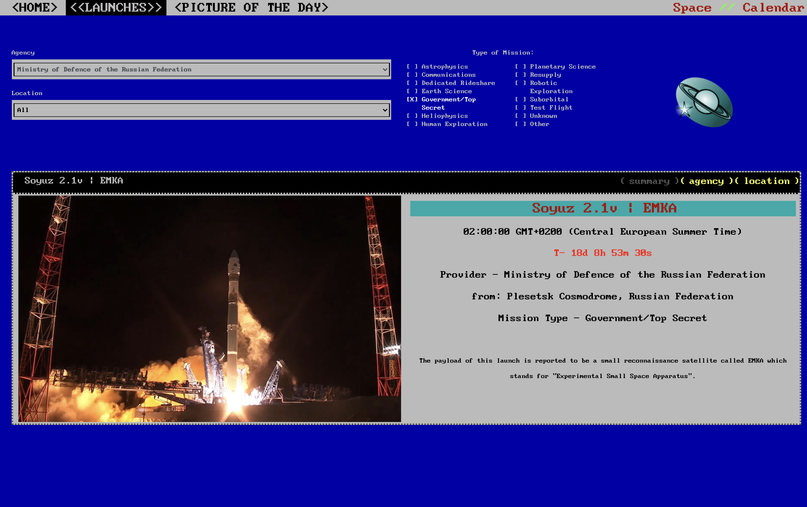

# :rocket: THE SPACE CALENDAR :rocket:

**Stay up to date with current Astronomic events!**


[https://spacecalendar.netlify.app/](https://spacecalendar.netlify.app/)

---

## About

created within a timeframe of 3 weeks as part of the training at _Code Academy Berlin_ using vanillaJS, **Space Calendar** offers a vintage-computer-style interface for visitors to:

- **Learn** more about different space related topics


- **Browse & Filter** through upcoming launches(provided by the **_*Space Devs*_ API**)

|  |  |
| ----------------------------------- | ----------------------------------- |

- **admire** beautiful pictures from outer space(provided by the **_*NASA APOD*_ API**)
  

---

## Running locally

to run locally:

1. Get a NASA APOD API Key at [https://api.nasa.gov/](https://api.nasa.gov/)

2. Clone the repo

```sh
git clone https://github.com/OBenshi/space.git
```

3. create a config.js file

4. Enter your API key in `config.js`

```JS
const APOD_TOKEN = 'ENTER YOUR API';
```
